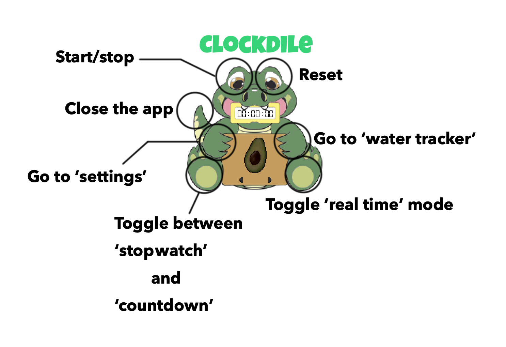

# Introduction
Cute desktop pet! 🐊 Keeps track time & daily water consumption for you.

### Functionalities
* Stopwatch
* Countdown
* Real time clock
* Water tracker (8 cups of water)



# Download
### Development
In terminal, run the following:

```
git clone https://github.com/Kolyn090/Clockdile.git
```
### Application
Download folder `Clockdile.app` and double click it
to open (need to trust the project if asked). Works
on WinOS and MacOS.

# Credits
* [crocodile sound effect](https://www.zapsplat.com/sound-effect-category/alligators-and-crocodiles/)
* [Little crocodile](https://www.vectorstock.com/royalty-free-vector/little-crocodile-vector-4641386)
* Art reword by Jianxin (Kolyn) Lin
* [avocado font](https://www.dafont.com/avocado-2.font)
* [digital-7 font](http://www.styleseven.com)
* Required assets to convert jar to app: https://www.youtube.com/watch?v=ZI3U4I2nK2s
